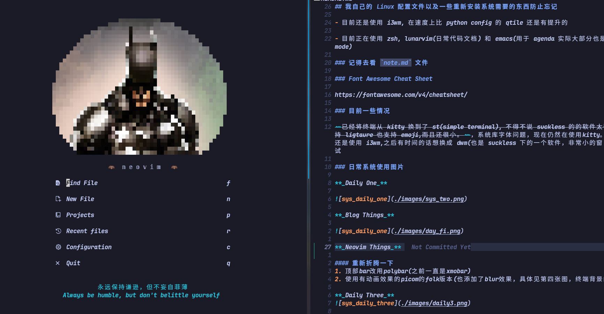

## 我自己的 Linux 配置文件以及一些重新安装系统需要的东西防止忘记(部分配置，还一些不想上传比如emacs等)

* [记得去看 `note.md` 文件](#记得去看-notemd-文件)
* [Font Awesome Cheat Sheet](#font-awesome-cheat-sheet)
* [目前一些情况](#目前一些情况)
* [日常系统使用图片](#日常系统使用图片)
    * [重新折腾一下](#重新折腾一下)
* [无聊的事(这个事情肯定不是最近的，但是我也忘记这是啥时候了，懒得查看了😁)](#无聊的事这个事情肯定不是最近的但是我也忘记这是啥时候了懒得查看了)
* [Gentoo](#gentoo)
* [Now Daily](#now-daily)

> 模仿黑客帝国matrix, Trinity发送给Neo的电子屏幕显示。我记得是看了哪个文章来着不记得了，至少是一年前的事情了😁，当时还是疫情时期要做核算。用vhs实现的录制。

- 目前还是使用 i3wm, 在速度上比 python config 的 qtile 还是有提升的

- 目前正在使用 zsh, lunarvim(日常代码文档) 和 emacs(用于 agenda 实际大部分也是在用 evil-mode)

### 记得去看 `note.md` 文件

### Font Awesome Cheat Sheet

https://fontawesome.com/v4/cheatsheet/

### 目前一些情况

~~已经将终端从 kitty 换到了 st(simple terminal), 不得不说 suckless 的的软件太强了，st 支持 ligtaure 也支持 emoji,而且还很小。~~，系统库字体问题，现在仍然在使用kitty。窗口管理器还是使用 i3wm,之后有时间的话想换成 dwm(也是 suckless 下的一个软件，非常小的窗口管理器)试试

### 日常系统使用图片

**_Daily One_**

**_Blog Things_**

**_Neovim Things_**

#### 重新折腾一下
1. 顶部bar改用polybar(之前一直是xmobar)
2. 使用有动画效果的picom的folk版本(也添加了blur效果，具体见第四张图，终端背景的模糊效果)
3. 重新配置tmux以及starship

**_Daily Three_**

**_Daily Four_**

**_Renew Tmux And Prompt_**

---

### 无聊的事(这个事情肯定不是最近的，但是我也忘记这是啥时候了，懒得查看了😁)

最近在一块多余的硬盘上安装了 gentoo,不得不说，编译 chromium 是真的花时间..., 还有忘记打开i2c导致笔记本触控板不能用我是真的...(下次直接用现成的内核配置文件)

在这之前还折腾了lfs(Linux From Scratch 不是Large File System哦😄)，找个时间再来一次吧。

---

突然想起自己之前哈哈哈哈哈，凌晨看Linus发布第一个版本的Linux时写的说明，确实能感觉到他的热情，当时我也真的开心，没有为什么，只是觉得他做了一件十分了不起的事情。

哦对了，这个是为了防止我忘记才写的，因为我接触过也不少东西(主要是觉得有意思)，但是也忘记了很多了。(such as nginx 这种东西。还有啥来着？rancher?)

---

### Gentoo

在迁移之前用的硬盘上重新安装配置了一下 gentoo, 之前用的是 arch, 但是我觉得 gentoo 还是有一些优点的，比如说可以自己编译内核，可以自己选择一些特定的配置，还有就是可以自己选择一些特定的软件包，这样可以减少一些不必要的依赖。(别说，use flag 还是很有用的，顺带说一句，这个时候我还没调整picom的阴影blur效果，看着有点奇怪)

---

### Now Daily

如果有时间的话就试试nixos吧(目前安装了虚拟机，可以先试试，感觉全部序列化配置要很多时间)，但是鉴于之前我的硬盘迁移还可以，感觉序列化配置也不是很有必要。有时间再试试。
下面是我的虚拟机，有一个小的k8s集群，一些实验用的虚拟机。还有win。下一步的话可能会做一些验证方面的工作。比如netfilter框架等。

