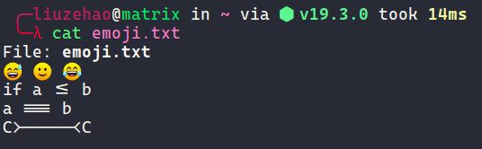
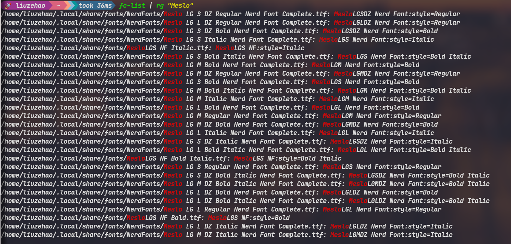
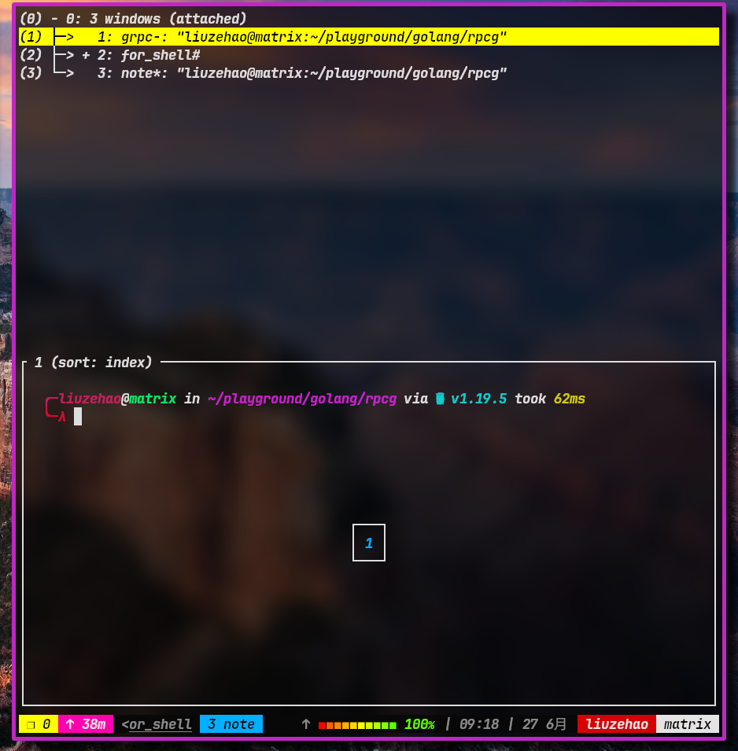

# 一些关于安装配置 Linux 命令行的问题记录

* [启动配置问题](#启动配置问题)
    * [重构启动文件](#重构启动文件)
* [命令行问题](#命令行问题)
    * [可能要安装的软件(暂且记得这些)](#可能要安装的软件暂且记得这些)
    * [安装问题](#安装问题)
* [远程服务器ssh配置](#远程服务器ssh配置)
    * [配置反向代理](#配置反向代理)
* [字体配置](#字体配置)
* [显卡配置](#显卡配置)
* [下载软件本地安装验证(以emacs为例)](#下载软件本地安装验证以emacs为例)
* [Linux虚拟机与宿主机共享目录配置](#linux虚拟机与宿主机共享目录配置)
* [对于neovide与lunarvim的结合操作](#对于neovide与lunarvim的结合操作)
* [安装字体](#安装字体)
* [获得字体相关图标](#获得字体相关图标)
* [jonaburg/picom](#jonaburgpicom)
* [glibc](#glibc)
* [终端颜色使用](#终端颜色使用)
* [tmux 日常工作流快捷键](#tmux-日常工作流快捷键)
* [GRUB hidden](#grub-hidden)
* [ArchLinux，使用pacman包管理工具忽略某些包的安装或升级](#archlinux使用pacman包管理工具忽略某些包的安装或升级)
* [安装TensorRT遇到的问题](#安装tensorrt遇到的问题)
* [Linux时间同步笔记](#linux时间同步笔记)
* [使用命令行来使用不同tty](#使用命令行来使用不同tty)
* [更新内核致使nvidia显卡无法使用的问题](#更新内核致使nvidia显卡无法使用的问题)
* [vmware workstation 模块安装问题](#vmware-workstation-模块安装问题)
* [bash, zsh在更新系统之后，命令前添加`sudo`前缀`<tab>`无法补全的问题](#bash-zsh在更新系统之后命令前添加sudo前缀tab无法补全的问题)
* [bluetooth](#bluetooth)

> 防止我哪天失忆，因此写下这个提醒文件 —— lazyhippo

哦，对了这个文档记录有些是根据 Ubuntu20.04 来记录的(因为开始记录的时候在使用 Ubuntu)，但是目前一直在使用 EndeaourOS(基于 arch 的一个 Linux 发行版), 所以失忆之后的话还想用 Linux 就暂时先用 Ubuntu,也可以自己慢慢尝试在 arch 上配置相关软件。

## 启动配置问题

### 重构启动文件

因为机子本身是双硬盘，双系统，系统升级偶尔会遇见启动项相关问题，这里记录一下

> 有这么个事情，原先我自己安装的 Windows11 为预览版本,挺多 bug 也用的不舒服,最近忍不了了
> 双系统个人目前经验(基于我目前配置双硬盘，每个盘分别安装 Windows11 和 Linux[至于发行版的话我用了相当多，目前还是在使用 EndeaourOS linux])

- 先安装 Windows

**_以下为之前记录，如果 grub 构建失败才重建引导 o ～，还有 arch(有安装脚本)， gentoo, 等发行版捏就得一个命令一个命令慢慢来, 但是文档齐全，消耗时间捏, 问题不大_**

- 再安装 Linux (两个系统分别选择两个盘)

  - 磁盘分区(个人设置)
    | 挂载点   | 分区类型 | 分区大小           |
    | ------   | -------- | --------           |
    | /        | ext4     | 80G                |
    | /home    | ext4     | 330G               |
    | 交换分区 | swap     | 18G                |
    | EFI 分区 | EFI      | 2G(属实有点太大了) |

    **_这个分区操作挺早的了，现在麻木了，硬盘大小也比这个大，所以随意就行_**
    现在Ubuntu 有了个`Reserved bios boot area` 用于解除严格限制的Lagacy BIOS和UEFI,这个 `Reserved bios boot area` 分区要在 /boot(Lagacy BIOS) 或者 UEFI 分区之前(1MB即可)
    即 `Reserved bios boot area` + EFI 或者 `Reserved bios boot area` + /boot 的组合。

    安装时注意将系统启动选择安装在 EFI 对应的分区, 还有 swap 和 EFI 其实可以不用这么大，我是因为我的内存比较大所以这么设置 swap,EFI 的话其实 300-500 就行，但是捏，我使用过 PopOS,它是强制要求 EFI 分区大于 1 个 G 的，所以我干脆全部设置大一些。

  - 重建 grub 引导(这个一般出事之后再使用吧)
    安装完成之后重启，重启进入 u 盘安装界面，选择尝试使用 Ubuntu，使用下面的命令重建 grub

    ```bash
    sudo fdisk -l # 查看分区信息
    sudo mount Ubuntu系统所在分区(就是一开始的更目录挂载的分区) /mnt
    sudo mount EFI分区 /mnt/boot/efi
    for i in /dev /dev/pts /proc /sys /run; do sudo mount -B $i /mnt$i; done
    sudo chroot /mnt
    grub-install Ubuntu所在的盘(注意这个是整个盘，名字要去掉分区的部分)
    update-grub
    ```

    之后重启，每次进入系统选择不同的盘启动即可

## 命令行问题

### 可能要安装的软件(暂且记得这些)

| 软件名称                                                      | 描述                                                                      |
| ------------------------------------------------------------- | ------------------------------------------------------------------------- |
| v2ray2                                                        | 配置系统代理                                                              |
| zsh                                                           | shell                                                                     |
| fish                                                          | shell                                                                     |
| oh my zsh                                                     | 美化 zsh                                                                  |
| zsh-autosuggestions                                           | zsh 提示插件                                                              |
| tmux                                                          | 终端复用                                                                  |
| oh my tmux                                                    | 美化 tmux                                                                 |
| git                                                           | 版本控制工具                                                              |
| build-essential                                               | 基础开发工具(gcc g++ make 等)                                             |
| i3                                                            | 窗口管理                                                                  |
| xmonad                                                        | 窗口管理                                                                  |
| qtile                                                         | 窗口管理                                                                  |
| xmobar                                                        | 窗口状态条                                                                |
| i3blocks                                                      | 桌面状态栏配置工具                                                        |
| rofi                                                          | 软件启动                                                                  |
| thunar                                                        | 文件管理器                                                                |
| compton                                                       | 给你的窗口 duang ～增加特效                                               |
| feh                                                           | 桌面壁纸                                                                  |
| xrandr                                                        | 多显示器设置                                                              |
| arandr                                                        | 多显示器设置(图形界面)生成 xrandr 命令                                    |
| i3-gaps                                                       | 用于配置窗口边框                                                          |
| vim                                                           | 文本编辑器                                                                |
| nvim                                                          | 文本编辑器                                                                |
| lunarvim                                                      | 基于 nvim 的一套配置(目前在用)                                            |
| stacer                                                        | 系统监控(比较喜欢它的图形化界面管理下载源)                                |
| docker                                                        | 容器管理                                                                  |
| nvm                                                           | node 版本管理                                                             |
| Anaconda                                                      | python 环境管理                                                           |
| rpm                                                           | 包管理工具                                                                |
| exa/lsd                                                       | ls 的替代方案                                                             |
| nnn                                                           | 命令行文件管理工具                                                        |
| lazygit                                                       | 命令行 git tui 操作                                                       |
| gitui                                                         | 命令行 git tui 操作                                                       |
| zsh-fast-syntax-highlighting                                  | zsh 终端语法高亮                                                          |
| zoxide                                                        | 有记忆的 cd 命令                                                          |
| alacritty, st, kitty                                          | 终端们(目前在用 alacritty)                                                |
| vhs                                                           | 终端记录                                                                  |
| fd, rg, bat, dust(现代版 du), duf(现代版 df), tokei(代码统计) | 日常工具                                                                  |
| grex                                                          | 正则表达式生成                                                            |
| FSearch                                                       | gtk3实现的unix-like文件搜索工具(很少用图形，我一般用命令行，但这个也不错) |

> 注意: 为了使用支持 ligature 这个特性的 alacritty，可以使用一个低版本的folk [alacritty](https://github.com/zenixls2/alacritty/tree/ligature)
> 下面命令构建 alacritty

```shell
git clone https://github.com/zenixls2/alacritty.git
cd alacritty
git checkout ligature
cargo build --release

# target/release 目录下可以找到alacritty二进制文件
```


<center> 下面是一个 alacritty 的截图 <center/>



> 因为之前系统(Garuda Linux)库freetype的问题，导致kitty不能正常显示emoji表情包，现在已经换掉，改成endeaourOS。该问题已经解决，所以现在还是在使用kitty，但是y1s1，alacritty是真的快。

### 安装问题

- v2raya 安装命令

  ```bash
  curl -Ls https://mirrors.v2raya.org/go.sh | sudo bash
  sudo systemctl disable v2ray --now
  wget -qO - https://apt.v2raya.mzz.pub/key/public-key.asc | sudo apt-key add -
  echo "deb https://apt.v2raya.mzz.pub/ v2raya main" | sudo tee /etc/apt/sources.list.d/v2raya.list
  sudo apt update
  sudo apt install v2raya
  sudo systemctl start v2raya.service
  sudo systemctl enable v2raya.service
  ```

  使用浏览器访问图形 UI http://localhost:2017
  之后创建帐号，导入订阅，在设置里面找到透明代理设置，或者可能是第一个选项，选择代理所有流量即可，之后选择节点，启动就行

- 在安装 Anaconda 的时候,目前来说遇见的问题是从官网下载的文件，在添加运行权限之后，会在最后
  报错 一个显示 Syntax error, 这个时候应该使用 bash Anaconda..来运行脚本

- 从目前使用过的几个终端模拟器中(terminator emulator)，Kitty(目前正在使用)

- 安装 Python 深度学习相关依赖时,先安装英伟达驱动(Nvidia),因为用的是 Ubuntu20.04,所以先使用命令
  自动安装驱动(amd 驱动我就不知道了哦~)

  ```bash
  ubuntu-drivers devices # 列出可安装的驱动,会有个建议安装的驱动
  sudo ubuntu-drivers autoinstall # 自动安装适合的驱动
  # 这里插一句，如果对自己的驱动版本不是很了解的话，切勿网上乱搜别人的例子来配置自己的驱动
  # 非常有可能会导致与显卡相关的一系列问题(别问我怎么知道的)
  # 此处可以重启一下 shutdown -h now
  nvidia-smi # 查看自己的cuda版本,并且去nvidia观望下载对应的文件(写这个note的时候官方还没有
  # Ubuntu22.04(刚刚发布半个月左右) 的相关包,但是使用20.04的也是可以的但是要多下载一个库文件
  # https://ubuntu.pkgs.org/20.04/ubuntu-main-amd64/liburcu6_0.11.1-2_amd64.deb.html
  ```

  安装完驱动之后，还要下载 cudnn,直接去 nvidia 下载对应版本的即可,下面是下载完成之后的需要的操作

  ```bash
  # 先cd到下载解压的目录内
  sudo cp include/cudnn.h /usr/local/cuda/include
  sudo cp lib/libcudnn* /usr/local/cuda/lib64
  sudo chmod a+r /usr/local/cuda/include/cudnn.h
  sudo chmod a+r /usr/local/cuda/lib64/libcudnn*
  # 在~/.zshrc文件内添加如下语句
  export CUDA_HOME=/usr/local/cuda-11.7 # 具体版本视具体安装情况定
  export PATH=$PATH:/usr/local/cuda-11.7/bin
  export LD_LIBRARY_PATH=$LD_LIBRARY_PATH:/usr/local/cuda-11.7/lib64
  ```

- 解压 xz 后缀文件

  ```bash
  tar -xvJf 文件名称 # 具体的参数对应什么有人看到的话自己去查吧不解释
  ```

- Anaconda 创建新的 python 虚拟环境并且安装 tensorflow(已经安装了 tensorflow 既不需要安装 keras)以及测试

  ```bash
  conda create -n 虚拟环境名称 python=版本 # 自己目前使用的是3.7.11
  pip install tensorflow
  ```

  python 测试代码(本来就是官网的代码,只是自己放在这方便一点,以后就懒得去找了)

  ```python
  import tensorflow as tf
  mnist = tf.keras.datasets.mnist

  (x_train, y_train),(x_test, y_test) = mnist.load_data()
  x_train, x_test = x_train / 255.0, x_test / 255.0

  model = tf.keras.models.Sequential([

  tf.keras.layers.Flatten(input_shape=(28, 28)),
  tf.keras.layers.Dense(128, activation='relu'),
  tf.keras.layers.Dropout(0.2),
  tf.keras.layers.Dense(10, activation='softmax')])

  model.compile(optimizer='adam',
  loss='sparse_categorical_crossentropy',
  metrics=['accuracy'])

  model.fit(x_train, y_train, epochs=5)
  model.evaluate(x_test, y_test)
  ```

- 设置默认终端模拟器(此处 Alacritty 为例)

  ```bash
  sudo update-alternatives --install /usr/bin/x-terminal-emulator x-terminal-emulator `which alacritty` 50
  sudo update-alternatives --config x-terminal-emulator
  # 之后选择一下就好了
  ```

  这里说一下，这个是 gnome 之类的图形界面设置，我现在都直接使用窗口管理器，所以直接在对应的窗口管理器里面设置就好

- i3wm 的一些可能要需安装的软件

  - i3-gaps 窗口间 gap 设置
  - i3blocks 桌面状态栏设置
  - feh 壁纸设置
  - 其他就是配置文件吧，反正都在这了

- 设置 Ubuntu 内核不自动更新

  ```bash
  sudo apt-mark hold linux-generic linux-image-generic linux-headers-generic
  ```

- 相关配置文件所在位置(可以自己设置位置，在此只是自己的目前配置位置)

  | 配置文件名称             | 说明                                                                | 配置文件路径                         |
  | ------------------------ | ------------------------------------------------------------------- | ------------------------------------ |
  | compton.conf/picom.confg | compton/picom 配置文件(至少我的机子上compton是picom的symbolic link) | `$HOME/.config/compton.conf`         |
  | config                   | i3wm 配置文件                                                       | `$HOME/.config/i3/config`            |
  | config.lua               | 目前使用的 lunarvim 配置文件                                        | `$HOME/.config/lvim/config.lua`      |
  | i3blocks.conf            | i3blocks 状态栏配置文件                                             | `$HOME/.config/i3/i3blocks.conf`     |
  | bing_wallpaper.sh        | 获取 bing 壁纸 sh 脚本                                              | `$HOME/.config/i3/bing_wallpaper.sh` |

- xmonad
  需要安装 xmonad,xmonad-contrib,xmobar
- 需要注意的是，xrandr 和 compton 或者 picom 可能会导致外接显示器黑屏(至少我遇见了)(也有可能是因为gpu没有选择独显)
- 中文输入法安装

```shell
# arch 下，其他发行版安装对应的包就行，ibus用于在kitty中使用中文
sudo pacman -S fcitx5-im fcitx5-chinese-addons fcitx5-rime ibus
```

在 /etc/environment 中写入

```
BROWSER=firefox
EDITOR=nano
GTK_IM_MODULE=fcitx
QT_IM_MODULE=fcitx
XMODIFIERS=@im=fcitx
SDL_IM_MODULE=fcitx
# 这一行使用ibus与kitty交互，输入中文
GLFW_IM_MODULE=ibus
```

## 远程服务器ssh配置
在本地使用 `ssh-keygen -t rsa -C "comment 邮箱啥的"` 生成公钥和私钥，之后将pub结尾的公钥写入服务器的 `~/.ssh/authorized_keys` 文件内。
注意这里可能需要配置文件夹权限以及sshd服务配置。下面命令看看参考就行，就怕自己忘记。

```shell
ssh-keygen -t rsa -C "asdfasdf@email.com"
# 这个命令直接将对应pub的公钥放到上升authorized_keys文件内
# 当然也可以直接写入那个文件
ssh-copy-id -i ~/.ssh/n_rsa.pub username@host
# 权限啥意思懂得都懂
chmod 700 ~/.ssh
chmod 600 ~/.ssh/authorized_keys

```

```text
# 最后配置
File: /etc/ssh/sshd_config
# ...
# 把这个注释打开
AuthorizedKeysFile: ~/.ssh/authorized_keys
# 顺带说一句，我不喜欢root可以登录，所以可以下面配置
PermitRootLogin no
# 这里配置是否允许使用密码登录
PasswordAuthentication no
# ...
```

最后重启sshd服务 我使用的是systemd 所以使用命令 `sudo systemctl restart sshd`

我本地的`~/.ssh/config` 文件内相应的配置为

```text

Host aliyun_server
HostName 阿里云的ip啥的
User liuzehao
IdentityFile ~/.ssh/aliyun_rsa # 指向对应公钥的私钥文件

Host nittin
HostName github.com # github 啥的
IdentityFile ~/.ssh/nittin_rsa
User niT-Tin
Port 默认不写是22,当然也可以显式地设置成别的端口，如果服务器在监听的话
```

配置之后类似可以将 `git clone git@github.com:niT-Tin/asdf.git` 替换为 `git clone git@nittin:niT-Tin/asdf.git`

### 配置反向代理

这里将隔离机器作为中间跳板，连接实际开发机器与客户机器，因为这里我只是单纯拿两个本地机器测试，所以地址都为内网ip,实际上可以develop只能，连接isolate,而isolate无法连接develop,client通过连接isolate与develop通信，进而隐藏develop

```text
                                                                                                ┌───────────┐  
                                                                                                │           │  
                                                                                                │   client  │  
                                                                                                │           │  
                                                                                                └─────┬─────┘  
                                                                                                      │        
                                                                2. ssh -p 7777 user@192.168.217.102   │
                                                                  (客户端运行指定对应端口)            │        
                                                                                                      │        
                                                                                                      │        
                                                                                                      │        
                                                                                                      │        
                                                                                                      │        
                                                                                                      │        
                                                                                                      │        
                                                                                                      │
                (develop 上运行如下命令，将isolate的7777端口流量代理到本机22端口)                     ▼        
   ┌───────┐ 1. ssh -R 192.168.217.102:7777:localhost:22 user@192.168.217.102                      ┌─────────┐ 
   │       ├──────────────────────────────────────────────────────────────────────────────────────►│         │ 
   │develop│                                                                                       │ isolate │ 
   │       │◄──────────────────────────────────────────────────────────────────────────────────────┤         │ 
   └───────┘                      3. to develop                                                    └─────────┘ 
    192.168.217.101                                                                                  192.168.217.102
```

这里注意配置isolate的sshd_config文件，需要将`GatewayPorts`项设置为yes

## 字体配置

具体查看字体文件夹内的配置以及位置, 还有 st 的 `config.h` 文件内的字体对应安装即可

英文字符和中文字符在有些字体下宽度并没有很好按照一定比例渲染。比如我自己终端使用venn.nvim插件画了图，但是在typora内中文宽度与英文宽度有问题。解决的办法是修改typora的字体(当然我终端是也支持这种字体)

字体
```txt
https://github.com/be5invis/Sarasa-Gothic
Noto Sans CJK(思源黑体)
```
修改Typora代码部分字体(因为我把图画的放在代码块内，具体放在别的地方可以对应不同的css选择器)，在 `~/.config/Typora/themes` 文件夹下添加 `base.user.css` 文件。下面是选择到代码块之后改字体的css

```css
.CodeMirror-wrap .CodeMirror-code pre {
  font-family: "Sarasa Fixed";
}
```

## 显卡配置

新安装的arch based系统可能是使用cpu的集成显卡，这个时候可以安装optimus来选择nvidia(我目前是这个独立显卡)。下面是命令行。(还是建议直接去github optimus的仓库，文档写的很清楚了)

我这里自己安装了EndeaourOS，需要在`/etc/optimus-manager/optimus-manager.conf` 的文件内添加如下内容。

```text
[optimus]
startup_mode=nvidia
```

设置为启动时选择nvidia(也就是我自己的独立显卡)作为主显卡。

当内核更新之后，optimus 可能需要更新，(我在内核版本从6.2 --> 6.3 的更新中optimus未更新导致内置屏幕黑屏)

```
yay -S optimus-manager optimus-manager-qt
```

对了，如果是自己安装的arch或者gentoo之类的，记得写个[hook](#更新内核致使nvidia显卡无法使用的问题), 在每次更新内核之后重新自动编译nvidia驱动，vmware的模块也需要重新编译安装(这个可以重启之后sudo vmware点击install来安装)

## 下载软件本地安装验证(以emacs为例)

在gnu官方下载emacs http://ftp.gnu.org/gnu/emacs/ ，下载gz或者xz源文件，并且下载对应版本的sig文件。

从官方公钥文件将公钥导入本地
```shell
wget https://ftp.gnu.org/gnu/gnu-keyring.gpg
gpg --import gnu-keyring.gpg
```

导入完成之后，验证文件

```shell
# gpg 验证格式
# gpg --verify <filename>.sig <filename>
gpg --verify emacs-28.2.tar.gz.sig emacs-28.2.tar.gz
```

## Linux虚拟机与宿主机共享目录配置

因为目前在Linux上使用vmware感觉还不错，所以在用。
**首先外部vmware共享文件夹设置主机要共享的文件夹位置。**
安装 `vmtools` 如果软件能通过vmware安装就用vmware GUI界面安装，或者使用 包管理器安装 `open-vm-tools`
编辑`/etc/fstab`
添加下面一行
```text
.host:/ ${dir_path} fuse.vmhgfs-fuse allow_other 0 2
```
这里的 `${dir_path}` 为具体我需要挂载到的内部Linux的文件夹路径

如果是VirtualBox的话，去官网下载一个 `VBoxGuestAdditions.{version}.iso` 文件，在虚拟机内挂载一下，进入对应目录，挂载一下，安装一下，最后查一下官方共享操作😄。

## 对于neovide与lunarvim的结合操作

> 挺早一段时间尝试使用neovide(一个neovim的gui前端)，光标动态效果确实好玩(我后来在vscode中也启用了smooth cursor)，但是我目前使用的终端下编辑器虽然也是neovim，但是配置是基于lunarvim。
> lunarvim有自己的二进制文件，但是neovide并不读取lunarvim的配置，而是直接读取neovim的配置。在产看了neovide的部分源码以及lunarvim的可执行脚本(其实就是一个shell脚本)之后，我发现可以做出如下修改来让neovim读取lunarvim配置，neovide这样neovide就能应用在lunarvim上了。

将原先位于 `PATH` 内的nvim可执行文件改名，再创建一个与nvim同名的shell脚本，添加执行权限用来代替原先的nvim。可执行文件内容为如下。

> 注意：此时lunarvim的版本为1.2(此时实际官方已经发布了1.3，但是我自己使用有太多bug，干脆回退了版本nvim也并没有使用0.9而是使用0.8)。

---

**忘记看文档了**

可以使用 `--neovim-bin` 参数或者设置 `$NEOVIM_BIN` 变量来设置要启动的neovim二进制文件。也就是说如果要neovide自动打开lunarvim这样类似的预配置并且有自己的可执行文件可以使用下面的命令。

```bash
neovide --neovim-bin ~/.local/bin/lvim
# or
NEOVIM_BIN=~/.local/bin/lvim
neovide
```
这里 `~/.local/bin/lvim` 是luarvim的可执行文件的位置。顺带说一句，现在的neovide(0.11.0)Linux下可以输入中文了。

```shell

#!/usr/bin/env bash
export MYHOME="/home/liuzehao"
export vimbin="/usr/local/bin/nvim.8"
export LUNARVIM_RUNTIME_DIR="${LUNARVIM_RUNTIME_DIR:-"$MYHOME/.local/share/lunarvim"}"
export LUNARVIM_CONFIG_DIR="${LUNARVIM_CONFIG_DIR:-"$MYHOME/.config/lvim"}"
export LUNARVIM_CACHE_DIR="${LUNARVIM_CACHE_DIR:-"$MYHOME/.cache/lvim"}"

export LUNARVIM_BASE_DIR="${LUNARVIM_BASE_DIR:-"$MYHOME/.local/share/lunarvim/lvim"}"
exec -a nvim $vimbin -u "$LUNARVIM_BASE_DIR/init.lua" "$@"
```

## 安装字体
下载ttf文件之后可以在`/usr/share/fonts`文件夹下创建对应字体名称的文件夹，然后把ttf文件放进去，然后在文件夹内运行下面两行命令。(还可以放在`$HOME/.local/share/fonts`文件夹下面)


```bash
sudo mkfontdir
sudo mkfontscale
```

最后cache一下

```bash
fc-cache
```

我咋还记得我以前不是这么装字体的，🤔 我给忘记了，🤗暂时记录下我记得的。

vscode还需要安装下面这个字体来让vscode的内部终端不至于字符乱码



## 获得字体相关图标

可以安装 `font-manager` 打开之后选择对应字体即可看到有的图标，选择图标右键可以复制，但是有些时候会错位不知道为什么

```shell
sudo pacman -S font-manager
```
## jonaburg/picom

因为要实现动画效果(别说，打字的时候显示候选汉字也有动画，挺不错)，所以使用 [jonaburg/picom](https://github.com/jonaburg/picom)

emm... 好吧，为了更好的动画效果我又用了这一个folk版本的picom,但是需要在后面加上 `--experimental-backends` 选项。因为加了这个blur才能正常，但是圆角就不正常了，而且每次进入i3wm,
需要restart，也就是`mod+Shift+r` 让polybar显示出来，不知道为什么，不使用 `--experimental-backends` 就能正常显示并且圆角正常，但是blur不正常，权衡之后，还是想要blur。


可以按照github来编译，但是aur里面已经有了，所以可以直接安装。

```shell
# yay -S picom-jonaburg-git
yay -S picom-pijulius-git
```

`picom` 目录下不同的版本对应的配置文件都做了不同命名，`picom.conf` 是当前正在用的版本。

再来又找到个解决了上面问题的picom的folk: https://github.com/yaocccc/picom

这个有arch对应的PKGBUILD文件如下
```shell

_forkname=yaocccc
pkgname=picom-animations-git
_gitname=picom
pkgver=1788__2023.02.13
pkgrel=1
pkgdesc="X compositor (fork of compton) (git-version; animation fork)"
arch=(i686 x86_64)
url="https://github.com/${_forkname}/${_gitname}"
license=('MIT' 'MPL2')
depends=('libgl' 'libev' 'pcre' 'libx11' 'xcb-util-renderutil' 'libxcb' 'xcb-util-image' 'libxext'
         'pixman' 'libconfig' 'libdbus' 'hicolor-icon-theme')
makedepends=('git' 'mesa' 'meson' 'asciidoc' 'uthash' 'xorgproto')
optdepends=('dbus:          To control picom via D-Bus'
            'xorg-xwininfo: For picom-trans'
            'xorg-xprop:    For picom-trans'
            'python:        For picom-convgen.py')
provides=('compton' 'compton-git' 'picom')
conflicts=('compton' 'compton-git' 'picom')
replaces=('compton-git')
source=(git+"https://github.com/${_forkname}/${_gitname}.git")
sha256sums=("SKIP")

pkgver() {
    cd ${_gitname}
    _tag=$(git describe --tags | sed 's:^v::') # tag is mobile, and switches between numbers and letters, can't use it for versioning
    _commits=$(git rev-list --count HEAD) # total commits is the most sane way of getting incremental pkgver
    _date=$(git log -1 --date=short --pretty=format:%cd)
    printf "%s_%s_%s\n" "${_commits}" "${_tag}" "${_date}" | sed 's/-/./g'
}

build() {
  cd "${srcdir}/${_gitname}"
  meson --buildtype=release . build --prefix=/usr -Dwith_docs=true
  ninja -C build
}

package() {
  cd "${srcdir}/${_gitname}"

  DESTDIR="${pkgdir}" ninja -C build install

  # install license
  install -D -m644 "LICENSES/MIT" "${pkgdir}/usr/share/licenses/${pkgname}/LICENSE-MIT"

  # example conf
  install -D -m644 "picom.sample.conf" "${pkgdir}/etc/xdg/picom.conf.example"
}
```
安装直接在有该文件的目录下 `makepkg -si` 就行了。

## glibc

因为需要在服务器上运行一些代码，为了远程开发方便，决定使用vscode的remote插件。在安装对应语言的lsp时，发现可以远程安装lsp,这到挺新鲜，因为我安装的是rust-analyzer,因为本机的glibc版本服务器并不支持。

所以打算安装一下，在编译完libc之后，打算做软连接，但是我的zsh直接 `segmentation fault` 了，哈哈哈哈哈，太傻了。所有命令不能执行(除了shell内置的)。

最简单的办法是，每次执行命令之前加入`LD_PRELOAD=旧了libc的so路径`  也就是 `LD_PRELOAD=旧了libc的so路径 命令`, 使用之前的libc

我这为了暂时恢复，就将/lib64/libc.so.6 又指向了旧的libc,也就修复了。只能说太傻了。

```shell
LD_PRELOAD=/lib64/libc-2.17.so rm -f /lib64/libc.so.6
LD_PRELOAD=/lib64/libc-2.17.so ln -s /lib64/libc-2.17.so /lib64/libc.so.6
```

暂时懒得去查，单纯记录一下,还有一种是: 
```text
[root@managernode ~]# ls
ls: relocation error: /lib/libc.so.6: symbol _dl_starting_up, version GLIBC_PRIVATE not defined in file ld-linux-x86-64.so.2 或者 libc.so.6 with link time reference
```

将老版本的libc的so文件和ld的so文件重新做软链接

```shell
sln /usr/lib64/libc-2.17.so /lib64/libc.so.6
sln /usr/lib64/ld-2.17.so /usr/lib64/ld-linux-x86-64.so.2
```

最后还是提醒一下，一些较为广泛使用的底层库不要轻易动，如果还有其他报错，看错误信息，查看错误文件类型，查找错误原因，查找解决办法。(可能会有其他的一些链接错误)

## 终端颜色使用

首先最基础的就是下面的操作(可以看我的bash文章，笑死😅，这不是给自己看的吗)

- 颜色及其对应代码列表

  | 字体颜色 | 颜色代码 | 背景颜色 | 颜色代码 |
  | :------: | :------: | :------: | :------: |
  |   重置   |    0     |   重置   |    0     |
  |   黑色   |    30    |   黑色   |    40    |
  |   红色   |    31    |   红色   |    41    |
  |   绿色   |    32    |   绿色   |    42    |
  |   黄色   |    33    |   黄色   |    43    |
  |   蓝色   |    34    |   蓝色   |    44    |
  |   洋红   |    35    |   洋红   |    45    |
  |   青色   |    36    |   青色   |    46    |
  |   白色   |    37    |   白色   |    47    |

代码如下
`-e` 表示使用转义字符串, `-n` 不输出额外的换行

```shell
echo -ne "\e[1;31m This\e[0m\e[1;32m is\e[0m\e[1;33m colorful\e[0m\e[1;34m words \e[0m"

echo -ne "\e[1;41m\e[1;34mHello\e[0m \e[1;47m\e[1;32mWorld\e[0m"
```

> 注意，要设置颜色需要使用 `\e[1;` 开始后跟颜色。重置则使用 `\e[0m` 具体看上一个例子

以上是最基础的颜色显示，其中在终端允许的情况下，还可以开启rgb模式或者256模式

开启rgb模式
```shell
echo -e "\e[38;2;255;165;0mThis is orange text.\e[0m"
```
这里的格式为`"\e[38;2;<R>;<G>;<B>m{Text}]"`。38表示前景色(背景色可以用48开启)，2表示使用rgb模式，要使用256模式可以使用5。

## tmux 日常工作流快捷键

因为安装了默认的oh my tmux,快捷键可能与没有配置的tmux不同，但是总体来说直接man看一下用法就行。这里防止我以后失忆或者老了，连man都用不来所以记录一下。

prefix = ctrl + a

| 快捷键       | 作用                                                                  |
| :---:        | :---:                                                                 |
| `<prefix>` _ | 横向打开一个子窗口                                                    |
| `<prefix>` - | 纵向打开一个子窗口                                                    |
| `<prefix>` , | 重命名当前窗口                                                        |
| `<prefix>` s | 以交互方式为连接的客户端选择新会话                                    |
| `<prefix>` h | 移动光标到左边的窗口                                                  |
| `<prefix>` j | 移动光标到下边的窗口                                                  |
| `<prefix>` k | 移动光标到上边的窗口                                                  |
| `<prefix>` l | 移动光标到右边的窗口                                                  |
| `<prefix>` c | 创建新的窗口                                                          |
| `<prefix>` & | 关闭当前窗口                                                          |
| `<prefix>` [ | 进入滚动模式，之后可以使用vim like的翻页或者移动方式比如Ctrl+f, j,k等 |
| `<prefix>` : | 进入命令模式，可以输入tmux命令回车执行eg：kill-server直接退出 😅      |
| `<prefix>` F | 打开fzf面板                                                           |
| `<prefix>` I | 重新加载配置                                                          |
| `<prefix>` > | 将当前pane交换到右边                                                  |
| `<prefix>` < | 将当前pane交换到左边                                                  |
| `<prefix>` + | 将当前pane最大化                                                      |

还有很多，具体就man一下就知道了。
在选择的时候，可以在按下 `l` 展开可以选择的窗口



## GRUB hidden

有时候可能使用grub启动系统，菜单会不现实(虚拟机上可能会)。这个时候可以直接修改 `/etc/default/grub` 文件，将 `GRUB_TIMEOUT_STYLE=hidden` 改为 `GRUB_TIMEOUT_STYLE=menu`，当然，`GRUB_TIMEOUT=5` 也可以设置菜单显示自动选择的时间为5s。

改完之后记得 `sudo update-grub`

---
**一些怕忘记加进来的以前的笔记**

## ArchLinux，使用pacman包管理工具忽略某些包的安装或升级

在 `/etc/pacman.conf` 文件中有字段 `IgnorePkg`。在后面添加需要忽略的包名即可，多个包用空格隔开

要忽略某一组包，可以使用 `IgnoreGroup` 字段，用法与 `IgnorePkg` 相同。

## 安装TensorRT遇到的问题

> 说实话，这个还是比赛的时候的事情，我都不记得有这回事了。

1. local://TensorRT...文件找不到
    首先记得看comment,在pinned的comment上明显指出，要自行下载TensorRT的tar.gz包放在这个自己clone下来的tensorrt目录下，这样就行了
1. 首先因为在Anaconda环境下CmakeList找不到pyconfig.h文件
    解决方案: 因为是需要libnvinfer.so,所以先让Anaconda环境失效，注释掉.zshrc中Anaconda相关，再重启终端
2. Python.h头文件找不到
    因为默认Linux上头文件搜索路径为`/usr/include` 和 `/usr/local/include`, 所以需要添加搜索路径, 当然一般可以在编译时添加 -I 参数 或者简单使用`pkg-config --cflags python3` 但是我
    根据此修改PKGBUILD文件，没有用处，可能是修改地方不对。由此另一种方法就是，添加环境变量`C_INCLUDE_PATH`(C语言include路径)或者`CPLUS_INCLUDE_PATH`(C++include路径)
    同理，使用动态链接库也可以如此，默认搜索库路径为`/usr/lib`和`/usr/local/lib` 可以在编译时使用 -L 指定库路径或者添加环境变量`LIBRARY_PATH`
3. 使用默认的PKGBUILD编译缓慢
    修改make相关添加-j选项，j后跟数字(一般为cpu核数)来提升编译速度 eg: `make -j$(nproc)`。nproc命令获取可使用的核数量。


## Linux时间同步笔记
同步时间使用ntp来实现
步骤：

1. 安装ntp软件
```bash
# 这是在Arch Linux上安装使用pacman,其他发行版也大差不差
sudo pacman -S ntp
```
2. 启动ntpd服务，查看上游时间服务器地址，以及与当前时间的offset
```bash
# 本机使用的是systemd的systemctl启动服务
systemctl start ntpd.service
# 启动服务之后，查看上游时间服务器地址
ntpq -p
# 以下为命令输出结果
     remote           refid      st t when poll reach   delay   offset  jitter
==============================================================================
 time.neu.edu.cn .PTP.            1 u   10   64    1   48.798  -287971   0.000
 ntp6.flashdance .INIT.          16 u    -   64    0    0.000   +0.000   0.000
 tock.ntp.infoma .GPS.            1 u    9   64    1  228.974  -287971   0.000
 ntp5.flashdance 194.58.202.20    2 u    6   64    1  385.518  -287972   0.000
# 此时关闭ntp服务，为后面ntpdate使用,释放占用的端口
systemctl stop ntpd.service
# 跟新时间(通过上面选择延迟较小的服务器来同步时间)
sudo ntpdate time.neu.edu.cn
```
其实如果知道时间服务器，比如这里的, neu(这里是山东大学)，可以直接使用 `sudo ntpdate 时间服务器` 不需要启动ntpd服务。

## 使用命令行来使用不同tty

```bash
# 切换到tty3
sudo chvt 3
```

或者使用systemd切换不同的target(这个你是知道的我就不说了)。默认情况下，multi-user.target 会映射到runlevel3.target,也就是能够联网的多用户模式。

```bash
sudo systemctl isolate multi-user.target
```

## 更新内核致使nvidia显卡无法使用的问题
1. 查看nvidia当前使用的驱动
    > 因为我之前做过gpu的虚拟机穿透，所以造成此处忘记修改`/etc/mkinitcpio.conf`文件
    ```bash
    lspci -k | grep -A 2 -E "(VGA|3D)"
    ```
    我的结果为vfio-pci
2. 编辑`/etc/mkinitcpio.conf`文件
    如果`MODULES=()`的小括号内有vfio-pci相关的，直接清空括号, 此处是因为做显卡直连我自己添加的

3. 此处使用dkms来自动编译Nvidia内核模块
    ```bash
    sudo pacman -S nvidia-dkms
    ```
4. 构建完之后，需要重新更新initramfs
    ```bash
    mkinitcpio -p linux
    ```
5. 防止忘记更新initramfs
    设置hook
    ```text
    文件名: /etc/pacman.d/hooks/nvidia.hook
    文件内容:
    [Trigger]
    Operation=Install
    Operation=Upgrade
    Operation=Remove
    Type=Package
    Target=nvidia
    Target=linux
    # Change the linux part above and in the Exec line if a different kernel is used
    
    [Action]
    Description=Update Nvidia module in initcpio
    Depends=mkinitcpio
    When=PostTransaction
    NeedsTargets
    Exec=/bin/sh -c 'while read -r trg; do case $trg in linux) exit 0; esac; done; /usr/bin/mkinitcpio -P'
    ```
6. 重启电脑

## vmware workstation 模块安装问题

如果是一些更新导致函数找不到，之类的，估计得更新模块源码。拉下来这个仓库https://github.com/mkubecek/vmware-host-modules。切换到对应版本分支(可能需要超前自己一些版本而，比如现在我是17.0.0 用的就是17.0.2)然后放到将vmmon-only以及vmnet文件夹打包成tar包，放在`/usr/lib/vmware/modules/source`下。

```bash
tar -cf vmmon.tar vmmon-only
tar -cf vmnet.tar vmnet-only
cp -v vmmon.tar vmnet.tar /usr/lib/vmware/modules/source/
vmware-modconfig --console --install-all
```
得6.5.2内核又出问题了，得给上面两个模块源码打patch，或者手动修改一下，修改也不大。
下面是patch文件以及地址

https://github.com/jeffersonchua/linux-6.5.0/blob/main/patch-17.0.2-6.5.0

```patch
--- vmware/vmmon-only/include/pgtbl.h	2023-06-30 08:04:13.247729900 +0800
+++ vmware/vmmon-only/include/pgtbl.h	2023-06-30 08:05:41.717728599 +0800
@@ -91,7 +91,7 @@
          } else {
             pte_t *pte;
 
-            pte = pte_offset_map(pmd, addr);
+            pte = pte_offset_kernel(pmd, addr);
             if (pte_present(*pte) == 0) {
                pte_unmap(pte);
                return INVALID_MPN;
--- vmware/vmnet-only/bridge.c	2023-06-30 09:13:50.917668443 +0800
+++ vmware/vmnet-only/bridge.c	2023-06-30 09:14:05.747668224 +0800
@@ -44,6 +44,7 @@
 #include <linux/if_arp.h>
 #include <net/tcp.h>
 #include <net/ipv6.h>
+#include <net/gso.h>
 
 #ifdef CONFIG_NET_RADIO
 #   include <linux/wireless.h>
```

7. 简单配置vscode的c编译与debug，每次不用都会忘记，还是记录一下

**编译任务**

在顶部菜单栏内有`Terminal`按钮，下面有`Configure Tasks`。点击之后选择对应编译器的任务，这里直选gcc，此时vscode会在当前目录下生成一个`.vscode`目录，里面有个`tasks.json`文件。如果需要别的什么额外编译参数，比如添加额外的库，可以在`args`数组内定义好。

eg:

```json
{
	"version": "2.0.0",
	"tasks": [
		{
			"type": "cppbuild",
			"label": "buildme",
			"command": "/usr/bin/gcc",
			"args": [
				"-fdiagnostics-color=always",
				"-g",
				"${file}",
				"-o",
				"${fileDirname}/${fileBasenameNoExtension}",
				"`pkg-config --libs --cflags libavutil libavformat libavcodec`"
			],
			"options": {
				"cwd": "${fileDirname}"
			},
			"problemMatcher": [
				"$gcc"
			],
			"group": "build",
			"detail": "编译器: /usr/bin/gcc"
		}
	]
}
```

最后在`Terminal`下有个`Run Task` 点击之后，会有对应名字的任务。这里任务的名字是json文件内的`label`标签的字符串。

点击运行之后便会使用gcc编译源文件。多文件等可以使用Makefile或者Cmake等，也是命令的事。不过没怎么配置过Cmake，用到再说吧。

**Debug**

在左边工具栏点击Debug按钮，可以在`.vscode`文件夹下添加`launch.json`文件。也可以直接点击`Configuring C/C++ debugging` ，当然创建空的launch.json之后也有`Add configuration` 按钮可以点击。点击之后选择`C/C++`(你看的懂啊)

`program`对应的值需要改成task内args编译出来的可执行文件名。这里是`${fileDirname}/${fileBasenameNoExtension}`。

最后可能需要添加`preLaunchTask`, `miDebuggerPath`, `preLaunchTask`在debug之前需要执行的任务，这里填写了之前的编译任务的`label`, `miDebuggerPath` 则是对应debugger,也就是我用的gdb二进制的位置,`/usr/bin/gdb`，对了记得修改`request` 类型为`launch`

```json
{
    // Use IntelliSense to learn about possible attributes.
    // Hover to view descriptions of existing attributes.
    // For more information, visit: https://go.microsoft.com/fwlink/?linkid=830387
    "version": "0.2.0",
    "configurations": [
        {
            "name": "(gdb) Attach",
            "type": "cppdbg",
            "request": "launch",
            "program": "${fileDirname}/${fileBasenameNoExtension}",
            "MIMode": "gdb",
            "setupCommands": [
                {
                    "description": "Enable pretty-printing for gdb",
                    "text": "-enable-pretty-printing",
                    "ignoreFailures": true
                },
                {
                    "description": "Set Disassembly Flavor to Intel",
                    "text": "-gdb-set disassembly-flavor intel",
                    "ignoreFailures": true
                }
            ],
            "preLaunchTask": "buildme",
            "miDebuggerPath": "/usr/bin/gdb"
        }
    ]
}
```

之后可以设置断点以及点击调试，只是第一次要选择对应要运行的任务。

下面是两个我在编译使用了ffmpeg相关库的c++程序的json文件例子

`launch.json`
```json

{
    "configurations": [
        {
            "name": "C/C++: gcc debug",
            "type": "cppdbg",
            "request": "launch",
            "program": "${fileDirname}/${fileBasenameNoExtension}",
            "args": [],
            "stopAtEntry": false,
            "cwd": "${fileDirname}",
            "environment": [],
            "externalConsole": false,
            "MIMode": "gdb",
            "setupCommands": [
                {
                    "description": "为 gdb 启用整齐打印",
                    "text": "-enable-pretty-printing",
                    "ignoreFailures": true
                },
                {
                    "description": "将反汇编风格设置为 Intel",
                    "text": "-gdb-set disassembly-flavor intel",
                    "ignoreFailures": true
                }
            ],
            "preLaunchTask": "C/C++: gcc build",
            "miDebuggerPath": "/usr/bin/gdb"
        }
    ],
    "version": "2.0.0"
}
```

`tasks.json`

```json

{
	"version": "2.0.0",
	"tasks": [
		{
			"type": "cppbuild",
			"label": "C/C++: gcc build",
			"command": "/usr/bin/gcc",
			"args": [
				"-fdiagnostics-color=always",
				"-g",
				"${file}",
				"-o",
				"${fileDirname}/${fileBasenameNoExtension}",
				"`pkg-config --libs --cflags libavutil libavformat libavcodec`"
			],
			"options": {
				"cwd": "${fileDirname}"
			},
			"problemMatcher": [
				"$gcc"
			],
			"group": "build",
			"detail": "编译器: /usr/bin/gcc"
		}
	]
}
```

这里pkg-config命令要放在反引号里面，作为子命令运行。

## bash, zsh在更新系统之后，命令前添加`sudo`前缀`<tab>`无法补全的问题

对于bash的话，直接重新安装`bash-completion`就行(目前没搞清楚为什么，也不是很想搞清楚)

```bash
sudo pacman -S bash-completion
```

然而对于zsh，它的相关文件都在`/usr/share/zsh/`下面，包括一些命令的补全文件，目前还没结局，也没继续研究，后面解决了再来记录

## bluetooth

先看[archwiki](https://wiki.archlinux.org/title/Bluetooth?ref=itsfoss.com)。我已经安装了bluez相关的东西。

具体使用

1. (optional) Select a default controller with `select MAC_address`.
2. (optional) Enter `power on` to turn the power to the controller on if the device is set to off. It is on by default; see [Default adapter power state](https://wiki.archlinux.org/title/Bluetooth?ref=itsfoss.com#Default_adapter_power_state).
3. Enter `devices` to get the MAC address of the device with which to pair.
4. Enter device discovery mode with `scan on` command if device is not yet on the list.
5. Turn the agent on with `agent on` or choose a specific agent: if you press tab twice after `agent` you should see a list of available agents. A bluetooth agent is what manages the Bluetooth 'pairing code'. It can either respond to a 'pairing code' coming in, or can send one out. The `default-agent` should be appropriate in most cases.[1](https://askubuntu.com/questions/763939/bluetoothctl-what-is-a-bluetooth-agent)
6. Enter `pair MAC_address` to do the pairing (tab completion works).
7. If using a device without a PIN, one may need to manually trust the device before it can reconnect successfully. Enter `trust MAC_address` to do so.
8. Enter `connect MAC_address` to establish a connection.
